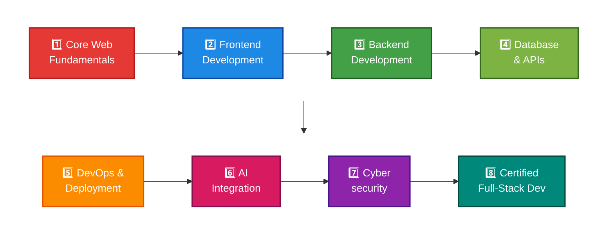

  

  

  

## 👩‍💻 About Me

I'm **Tharima Sultana Keya**, a passionate aspiring **FULL Stack  Developer** who enjoys turning ideas into functional, scalable and user-friendly web applications.

I'm currently focused on strengthening my frontend development skills through building real-world projects and improving my problem-solving abilities.

- 🌱 I'm currently learning **Full Stack Web Development**
- ⚛️ Exploring **React.js** and primarily focusing on frontend development
- 🚀 Exploring **Next.js**
- 🛠️ Building real-world projects to improve my development skills
- 💡 Interested in creating clean, responsive and user-friendly websites
- 🎯 My goal is to become a professional **Full Stack Web Developer**
- 🤝 Open to learning, collaboration and new opportunitie

## 🛠️ Skills in Technologies

**Languages:**

**CSS Frameworks & Libraries:**

**JavaScript Frameworks & Libraries:**

**Database & Model:**

**Deployment Platform:**

**Design & Graphics:**

**Tools & Technologies:**

  

## 💡 My Focus Areas

   🌐**Full-Stack Web Development (MERN)**

- 🎨 **Frontend:** React.js, Next.js, TypeScript
- ⚡ **Language:** JavaScript (ES6+), TypeScript
- 🛠️ **Backend:** Node.js, Express.js, REST APIs
- 🍃 **Database:** MongoDB, Mongoose
- 🔐 **Auth & Security:** JWT, bcrypt, validation
- 🧰 **Tools:** Git, GitHub, Postman, Docker (basic)
- 🚀 **Deployment:** Vercel, Render
- 🤖 **Currently Exploring:** AI / ML

  

  
## 📌 Featured Projects

### 🛍️ E-Commerce Website

  A responsive e-commerce website built with modern frontend technologies.

Tech: React • JavaScript • Tailwind CSS

<h2><b>📍 Social links for Contact</b></h2>

 🇧🇩 **Location:** Bangladesh

  

  

<h2><b>🔥 GitHub Streak</b></h2>

  

  

  

<h2><b>🌐 Connect With Me</b></h2>

  

🌍 Portfolio Website: Coming Soon!

## 📊 TECHNOLOGY STACK DASHBOARD

### 🎯 CORE WEB TECHNOLOGIES

| Category | Technologies | Proficiency |
|:--------:|:------------:|:-----------:|
| $\color{#8A2BE2}{\textbf{Frontend}}$ | React.js, Next.js, TypeScript, Tailwind CSS |  |
| $\color{#8A2BE2}{\textbf{Backend}}$ | Node.js, Express.js, Golang, REST APIs |  |
| $\color{#8A2BE2}{\textbf{Database}}$ | MongoDB, PostgreSQL, Prisma ORM, Mongoose |  |
| $\color{#8A2BE2}{\textbf{DevOps}}$ | Docker, Nginx, CI/CD, AWS, Firebase |  |
| $\color{#8A2BE2}{\textbf{AI Tools}}$ | Gemini AI, Jasper AI, OpenAI API, AI Automation |  |

## 🏆 **Target Certifications**

- 🍃 MongoDB Associate Developer
- ☁️ AWS Certified Cloud Practitioner → Developer Associate
- 🟢 OpenJS Node.js Services Developer (JSNSD)
- ⚛️ Meta Front-End / React Specialization (Coursera)
- 🐳 Docker Foundations 

 
## 📊 SKILL METRICS & PROGRESS

| Skill Category | Current Level | Projects Completed | Target Mastery |
|:--------------:|:-------------:|:------------------:|:--------------:|
| **React & Frontend** | 🟢 Advanced | 15+ | ⭐ Expert |
| **Node.js & Backend** | 🟢 Advanced | 12+ | ⭐ Expert |
| **Database Design** | 🟡 Intermediate+ | 10+ | 🟢 Advanced |
| **DevOps & Deployment** | 🟡 Intermediate+ | 8+ | 🟢 Advanced |
| **AI Integration** | 🟡 Intermediate | 5+ | 🟡 Intermediate+ |
| **Cybersecurity** | 🟡 Intermediate | 6+ | 🟢 Advanced |

## 📚 LEARNING PATH

## 🏆 **Target Certifications**

- 🍃 **MongoDB Associate Developer**
- ☁️ **AWS Certified Cloud Practitioner → Developer Associate**
- 🟢 **OpenJS Node.js Services Developer (JSNSD)**
- ⚛️ **Meta Front-End / React Specialization (Coursera)**
- 🐳 **Docker Foundations**

  

### ✍️ Random Dev Quote

